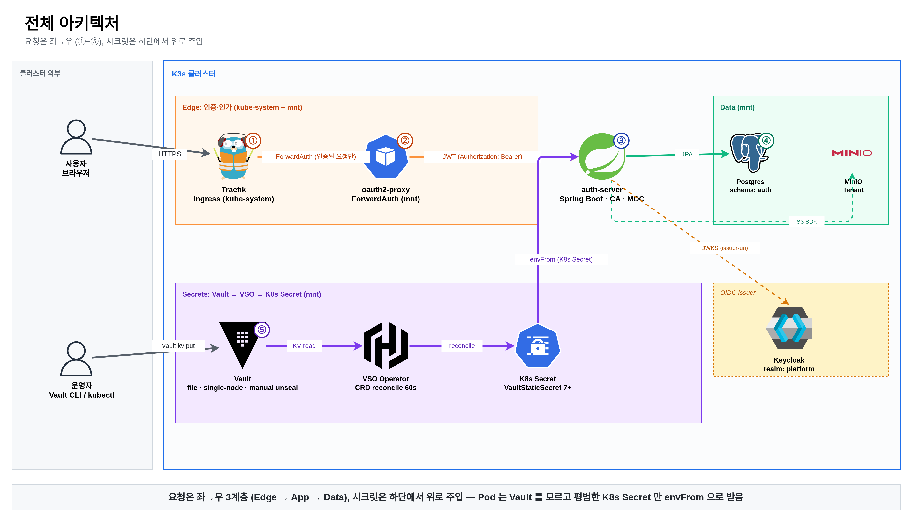
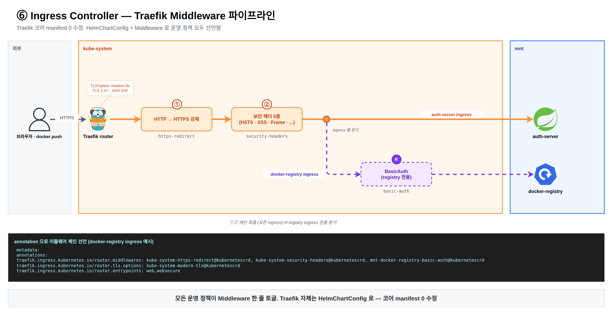
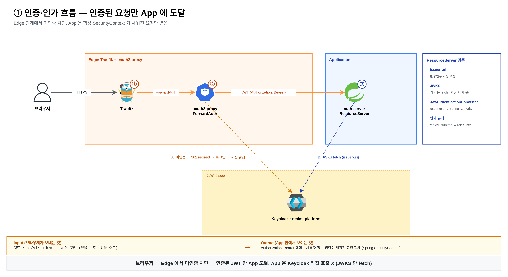

# Project-Infra

Kubernetes(K3s) 기반 백엔드 운영 환경을 **Git 단일 source-of-truth** 로 관리하는 개인 프로젝트. auth-server / Keycloak / PostgreSQL / MinIO / Docker Registry 를 Vault·VSO 시크릿 파이프라인 위에 올리고, NetworkPolicy default-deny 와 Traefik Ingress 를 통한 인증 차단을 함께 운영한다.

| | |
|---|---|
| **언어 / 런타임** | Bash, Kustomize, K3s 1.30, Helm |
| **핵심 컴포넌트** | HashiCorp Vault, Vault Secrets Operator, Traefik, Keycloak Operator, MinIO Operator, cert-manager, Flyway |
| **검증** | kustomize build / kubeconform / kube-linter 3 단 자동화 |
| **상태** | dev overlay 완성, staging/prod 의도적 미구현 |

---

## Why I Built This

> 백엔드 개발자가 직접 운영 환경을 손에 쥐고 책임지면, 코드 결정의 근거가 달라진다.

스프링 앱을 짜면서 늘 마주친 회색 지대가 있었다. **시크릿은 어떻게 주입되는지**, **DB 마이그레이션은 누가 언제 돌리는지**, **인증은 앱 안에서 처리하는 게 맞는지 게이트웨이에서 막는 게 맞는지** — 이걸 인프라 팀의 결정으로만 받아들이면 백엔드 코드는 늘 가정 위에 서 있게 된다.

그 가정을 직접 만들어 보고, 그게 깨지는 지점을 백엔드 코드의 시각에서 한 번 정리하기 위해 시작한 프로젝트. 결과적으로 다음을 다루게 됐다:

- Vault → VSO → K8s Secret → 앱 envFile 까지의 **시크릿 수명주기 전 구간**
- Flyway 마이그레이션이 앱보다 먼저 돌도록 강제하는 **배포 ordering**
- 인증을 앱이 아니라 **Ingress 단(oauth2-proxy + Keycloak)** 에서 처리했을 때의 책임 분리
- default-deny NetworkPolicy 환경에서 새 워크로드를 올릴 때 **백엔드가 작성해야 하는 매니페스트의 모양**

---

## Architecture



> 컴포넌트별 상세는 [docs/architecture.md](docs/architecture.md).

주요 흐름은 시퀀스 다이어그램으로 분리 (각 파일은 *하나의 시간 척도* 만 다룸):

- Secret Pipeline · [bootstrap (1 회)](docs/diagrams/sequence/secret-pipeline-bootstrap.md) / [runtime reconcile](docs/diagrams/sequence/secret-pipeline-runtime.md)
- ForwardAuth · [cold path (세션 만료당 1 회)](docs/diagrams/sequence/forward-auth-cold.md) / [warm path (운영 트래픽 99%)](docs/diagrams/sequence/forward-auth-warm.md)
- bootstrap Phase 0~7 의존성 표는 [docs/operations.md](docs/operations.md#bootstrap-단계)

---

## Highlighted Engineering Decisions

설명을 길게 늘어놓는 대신 결정 7 개와 *왜 그렇게 했는가* 만 남긴다.

### 1. VSO 의 SA 한 개를 Vault role 두 개로 쪼갠 권한 분리

VSO Operator 의 ServiceAccount(`vault-secrets-operator`) 는 한 개다. 그러나 Vault 쪽에서 `vso-auth-platform` / `vso-storage` 두 role 로 분리하고, policy 도 도메인별로 잘랐다. **auth-platform 토큰이 유출돼도 MinIO secret 은 보호된다.** 이 결정 때문에 VaultAuth CR 도 두 개가 됐고, 각 VaultStaticSecret 은 자기 도메인의 VaultAuth 만 참조한다.

→ [docs/vault-vso.md](docs/vault-vso.md#vaultauth--vaultstaticsecret-매핑)

### 2. default-deny NetworkPolicy + 명시적 east-west 허용

`mnt` 단일 namespace 안에서도 모든 Pod 는 ingress/egress 가 기본 차단된다 (`networkpolicy-baseline.yaml`). 새 워크로드를 올리려면 **무조건 NetworkPolicy 를 같이 작성해야** 한다. 이 마찰은 의도된 것 — wide-open 으로 시작하는 실수를 구조적으로 막는다. cross-namespace 참조는 `namespaceSelector` + `podSelector` 를 한 블록에 묶어 AND 시맨틱으로 작성한다 (별도 블록은 OR 가 되어 정책이 헐거워진다).

→ [docs/networking.md](docs/networking.md)

### 3. PSS Restricted 를 깨지 않기 위해 Vault 에서 `disable_mlock=true` 를 받아들였다

Vault 권장은 mlock 활성화지만, 그러려면 컨테이너에 `IPC_LOCK` capability 를 줘야 하고 PSS Restricted 와 충돌한다. **클러스터 전체 보안 baseline 을 깎느니 단일 컴포넌트에서 트레이드오프를 받는다** — 대신 swap off 노드에서만 운영하기로 했다. prod 승격 시 storage `file` → `raft` + KMS auto-unseal 로 같이 바뀐다.

→ [docs/vault-vso.md](docs/vault-vso.md#설계-결정)

### 4. K3s packaged Traefik 의 manifest 를 직접 수정하지 않는다

`/var/lib/rancher/k3s/server/manifests/traefik.yaml` 에 손을 대면 K3s 가 다음 부팅에 덮어쓴다. 그래서 `HelmChartConfig` overlay 로만 운영 설정을 override 하고, Middleware / TLSOption 도 별도 매니페스트로 둔다. **운영 정책이 Git 에서 사라지지 않는다.**



→ [docs/ingress-traefik.md](docs/ingress-traefik.md)

### 5. 인증을 앱이 아니라 Ingress 단에서 막는다 (ForwardAuth variant)

[`auth-server`](https://github.com/donghyeon-ka/project-auth-server/tree/develop) 코드 안에서 OIDC 처리를 하는 대신, Traefik `ForwardAuth → oauth2-proxy → Keycloak` 으로 게이트에서 끊는다. **백엔드 코드 입장에서는 인증 정책 변경이 코드 배포가 아니라 매니페스트 배포가 된다** — 컨트롤러에서 인증 분기가 사라지고, 단위 테스트는 인증을 mock 할 필요가 없어진다. Kustomize **component + variant overlay** 패턴(`components/forward-auth/` + `overlays/dev-with-forward-auth/`) 으로 기본 dev 와 인증 적용 dev 를 한 repo 에서 공존시킨다.



→ [docs/ingress-traefik.md](docs/ingress-traefik.md#forwardauth-variant)

### 6. dev 는 단일 `mnt` namespace, 실무 분리는 overlay 재구성으로

실무 원칙은 `auth` / `storage` / `security` / `registry` 별 namespace 분리. 그러나 dev / 학습 단계에서는 namespace 분리의 비용 (NetworkPolicy cross-ns 복잡도, RBAC 다중 적용) 이 단순성 이득을 깎는다. **base 매니페스트는 namespace 환경 중립으로 작성** 되어 있어, prod overlay 가 `namespace:` 필드만 다르게 가져가면 분리 가능. *결정을 미룬 게 아니라, base 가 그 결정을 받아낼 수 있게 만들어 둔 것*.

### 7. 이미지 tag 정책: dev 는 semver, prod 는 digest pin

dev 에서 digest pin 을 강제하면 image rotation 마다 매니페스트 PR 이 필요해 학습 / 실험 흐름이 끊긴다. 대신 prod overlay 가 모든 공식 이미지를 `@sha256:...` digest pin 으로 잠근다 — **supply-chain 무결성** 보장. 같은 base 매니페스트를 환경별로 다른 정책으로 적용하는 *overlay 환경 차등* 의 구체적 예시.

---

## Key Components

| 영역 | 사용 기술 | 책임 |
|---|---|---|
| Identity | Keycloak Operator 26.6.1, KeycloakRealmImport | OIDC IdP, realm/client Git 관리 |
| Auth gateway | Traefik ForwardAuth, oauth2-proxy | Ingress 단 인증 차단 |
| App | Spring [`auth-server`](https://github.com/donghyeon-ka/project-auth-server/tree/develop), `test-server-{1,2,3}` | 백엔드 워크로드 (Spring 코드는 별도 repo) |
| Data | PostgreSQL 16.4, Flyway 10.20.1 (PreSync Job) | DB + 스키마 마이그레이션 |
| Object storage | MinIO Operator, Tenant CRD | S3 호환 저장소, Registry 백엔드 |
| Secrets | HashiCorp Vault 1.17.2 + VSO | KV-v2 → K8s Secret 자동 동기화 |
| Registry | `registry:2.8.3` | 사내 Docker Registry, MinIO bucket 저장 |
| Ingress / TLS | Traefik (K3s packaged), cert-manager 1.20.2 | north-south 진입 + ACME TLS |
| Policy | NetworkPolicy, Pod Security Standards (restricted) | east-west 최소권한 + 워크로드 admission |

---

## Folder Structure (요약)

Kustomize **base / components / overlays** 3 층 구조 + 운영 스크립트.

| 디렉토리 | 역할 |
|---|---|
| `k8s/base/` | 환경 중립 매니페스트 (`managing` / `app` / `plugins` 3 영역) |
| `k8s/components/` | 재사용 Kustomize component (현재 `forward-auth` 1 개) |
| `k8s/overlays/dev/` | 완성된 dev 환경 |
| `k8s/overlays/dev-with-forward-auth/` | dev + ForwardAuth variant |
| `k8s/overlays/{staging,prod}/` | 의도적으로 비어둠 |
| `k8s/scripts/` | `bin` (진입점) / `ci` (validate.sh) / `lib` (공통) / `tasks` (재사용 작업) |
| `terraform/` | contracts 만 존재, 추후 구현 |
| `docs/` | 분할된 상세 문서 |

전체 트리와 각 하위 디렉토리의 의도는 [docs/architecture.md](docs/architecture.md#폴더-구조).

---

## NetworkPolicy 전략 (요약)

baseline 이 `default-deny-all` + `allow-dns-egress` 만 둔다. 모든 east-west 트래픽은 컴포넌트별 정책으로 명시 허용한다.

- `auth-server` ← `kube-system/traefik`(8080) → `postgres`(5432) + `keycloak`(8080)
- `keycloak` ← traefik(8080) + auth-server(8080) → postgres(5432) + Keycloak peer 통신
- `identity-postgres` ← keycloak / auth-server / migration-flyway (5432)
- `vault` ← VSO Operator Pod(8200)
- `docker-registry` ← namespace 내 전 Pod + traefik(5000) → minio(9000)

상세 매트릭스는 [docs/networking.md](docs/networking.md).

---

## Ingress / Traefik 전략 (요약)

dev 환경은 **K3s packaged Traefik 을 그대로 두되 매니페스트에 손을 대지 않는다.** `HelmChartConfig` overlay 로만 운영 설정을 override 하고, 공통 보안 정책은 `security-headers` Middleware + `modern-tls` TLSOption 으로 재사용한다.

- north-south Ingress: `project.com` → auth-server, `keycloak.dev.example.com` → Keycloak 최소 공개 path 만
- 인증 차단: Traefik ForwardAuth → oauth2-proxy → Keycloak (variant overlay)
- TLS: cert-manager v1.20.2 + ACME HTTP-01 ClusterIssuer
- realm/client: KeycloakRealmImport 로 Git 관리

상세는 [docs/ingress-traefik.md](docs/ingress-traefik.md).

---

## Vault / VSO 핵심

- Vault 1.17.2, file backend, single namespace 내부 ClusterIP 만
- Kubernetes auth method + `system:auth-delegator` ClusterRoleBinding
- 도메인별 policy/role 분리 (`vso-auth-platform` / `vso-storage`)
- VaultStaticSecret `destination.overwrite=false` — 수동 Secret 보호
- `refreshAfter=1h` 주기 동기화. 즉시 반영은 `kubectl -n mnt delete secret <name>` 후 reconcile

전체 시퀀스는 [bootstrap (1 회)](docs/diagrams/sequence/secret-pipeline-bootstrap.md) / [steady-state reconcile](docs/diagrams/sequence/secret-pipeline-runtime.md) 두 다이어그램, 설계 결정과 명령은 [docs/vault-vso.md](docs/vault-vso.md).

---

## Validation

```bash
bash k8s/scripts/ci/validate.sh
```

3 단 검증을 모든 overlay 에 적용한다:

1. **`kustomize build`** — 환경 중립성 / patch 유효성
2. **`kubeconform -strict`** — Kubernetes OpenAPI + Datree CRD catalog 기준 스키마 검사
3. **`kube-linter`** — securityContext / resources / PSS / image tag 등

`.kube-linter.yaml` 은 블록 단위 분석으로 발생하는 컨텍스트 오탐 4 종 (`dangling-service`, `non-existent-service-account`, `mismatching-selector`, `no-anti-affinity`) 만 제외하고 나머지 체크는 모두 활성. 목표 상태:

```
k8s/overlays/dev      build=ok  schema=ok  lint=ok
k8s/overlays/dev/vso  build=ok  schema=ok  lint=ok
```

운영 절차 / bootstrap 단계 / 환경별 차등은 [docs/operations.md](docs/operations.md), 실행 매뉴얼은 [guide.md](guide.md).

---

## Current Status

| 영역 | 상태 |
|---|---|
| dev overlay 매니페스트 | 완성 (kustomize/kubeconform/kube-linter 통과) |
| Vault + VSO 부트스트랩 | 완성 (idempotent 스크립트) |
| Traefik HelmChartConfig + Middleware | 완성 |
| ForwardAuth variant overlay | 매니페스트 준비 완료, 실 적용은 cert-manager / DNS 의존 |
| KeycloakRealmImport (Git-managed realm) | overlay 준비 완료 |
| cert-manager + ClusterIssuer | overlay 준비 완료, 실제 발급은 외부 DNS 필요 |
| staging / prod overlay | 의도적으로 비어둠 |
| Terraform 모듈 | 디렉토리 contracts 만 존재 |

---

## Limitations (honest scope)

학습 환경에서 의도적으로 멈춘 지점, 그리고 production 승격 시 바뀌어야 할 것을 솔직하게 적는다.

- **Vault HA 없음**: file backend 단일 노드. prod 에서는 `storage "raft"` + KMS auto-unseal 필수.
- **TLS 미발급**: cert-manager / ClusterIssuer 매니페스트는 있지만 실제 ACME 발급은 외부 DNS 가 Traefik 진입점을 가리켜야 완료된다.
- **end-to-end 인증 검증 미완**: oauth2-proxy 가 `ssl_insecure_skip_verify=true` 를 임시로 사용 중. cert-manager 도입 후 제거 예정. 로그인 + deny/allow negative test 는 인증서 발급 후에야 의미가 있다.
- **Postgres 백업 미구성**: Velero / pgBackRest CronJob 은 prod 승격 시 추가.
- **Terraform 미구현**: 디렉토리 구조만 두고 실제 모듈은 추후. 현재 인프라는 K3s 위에서만 동작.

---

## 보조 문서

- [docs/architecture.md](docs/architecture.md) — 폴더 구조 전체, 워크로드 표, 이미지 정책, Registry 인증 경계
- [docs/networking.md](docs/networking.md) — NetworkPolicy 매트릭스 / 작성 규칙
- [docs/ingress-traefik.md](docs/ingress-traefik.md) — Traefik HelmChartConfig, ForwardAuth variant, cert-manager, KeycloakRealmImport
- [docs/vault-vso.md](docs/vault-vso.md) — Kubernetes auth 초기화, policy/role 매핑, VSO Secret 카탈로그, dockerconfigjson `.auth` 이슈
- [docs/operations.md](docs/operations.md) — bootstrap 단계, validate.sh, 환경별 차등표
- [docs/diagrams/architecture/](docs/diagrams/architecture/) — draw.io 아키텍처 그림 원본
- [docs/diagrams/sequence/](docs/diagrams/sequence/) — Mermaid 시퀀스 다이어그램 (Secret Pipeline bootstrap/runtime · ForwardAuth cold/warm)
- [guide.md](guide.md) — 실제 실행 매뉴얼
