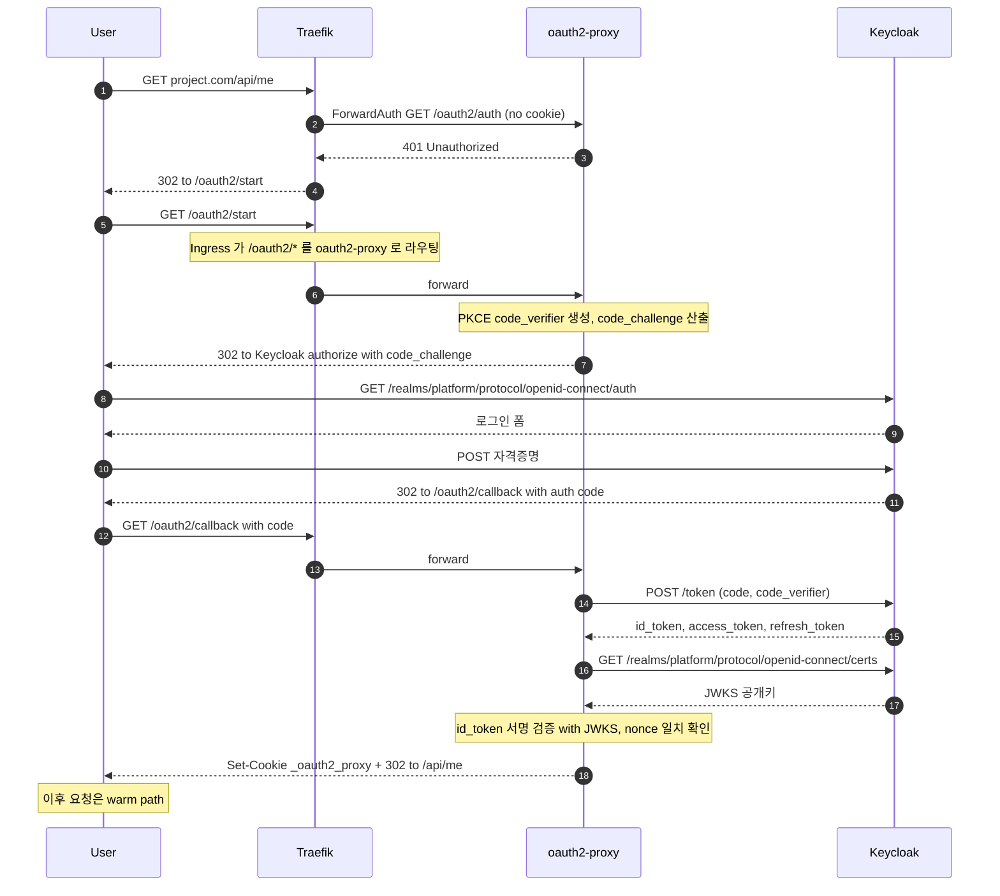

# ForwardAuth · Cold Path (최초 로그인)

세션 쿠키가 없는 첫 요청. OIDC Authorization Code Flow + PKCE 전 구간이 1 회 일어난다. **사용자당 세션 만료 주기마다 한 번** 만 발생 — 일상 운영 트래픽의 99% 는 [warm path](forward-auth-warm.md) 다.

> Traefik 의 path-based Ingress 라우팅이 전제: `project.com/oauth2/*` 는 oauth2-proxy 로, 그 외 path 는 ForwardAuth Middleware 를 거쳐 백엔드로 간다. 이 라우팅 결정이 그림의 모든 분기의 기반이다.

## 핵심 인사이트

- **Ingress 라우팅이 분기의 뿌리**: 그림의 Note 가 가리키듯 `/oauth2/*` 와 그 외 path 가 *Ingress 단에서* 갈린다. 이 라우팅이 없으면 cold path 가 시작 자체를 못 한다.
- **PKCE 가 핵심 보안 장치**: `code_verifier` 는 메시지 7~8 에서 oauth2-proxy 가 생성해 자기 세션에 저장하고, 메시지 16 에서 token exchange 시 함께 보낸다. Keycloak 은 `code_challenge` 와 매칭 검증. **authorization code 가 중간에 가로채지더라도 verifier 없이는 token 으로 교환 불가**. oauth2-proxy v7.5+ 는 PKCE 가 기본 활성.
- **JWKS 검증의 위치**: 메시지 18~19 (`GET .../certs`) 가 별개의 호출이다. oauth2-proxy 는 JWKS 를 *처음 1 회 fetch 후 캐시* 하고, Keycloak 의 JWKS endpoint 가 회전 가능 (`kid` 헤더로 식별). **id_token 서명 검증 (메시지 20 의 Note) 이 끝나야 쿠키가 발급되므로**, 이후 warm path 에서 백엔드가 받는 `X-Forwarded-User` 는 *이미 검증된 사용자* 다.
- **dev 환경의 임시값**: 현재 oauth2-proxy 설정에 `ssl_insecure_skip_verify=true`. 이유는 Keycloak 공개 호스트(`keycloak.dev.example.com`) cert 체인이 cert-manager 발급 전이라 미완성. cert-manager + ACME 발급 후 제거.

## 평소 요청 흐름은?

→ [forward-auth-warm.md](forward-auth-warm.md)
