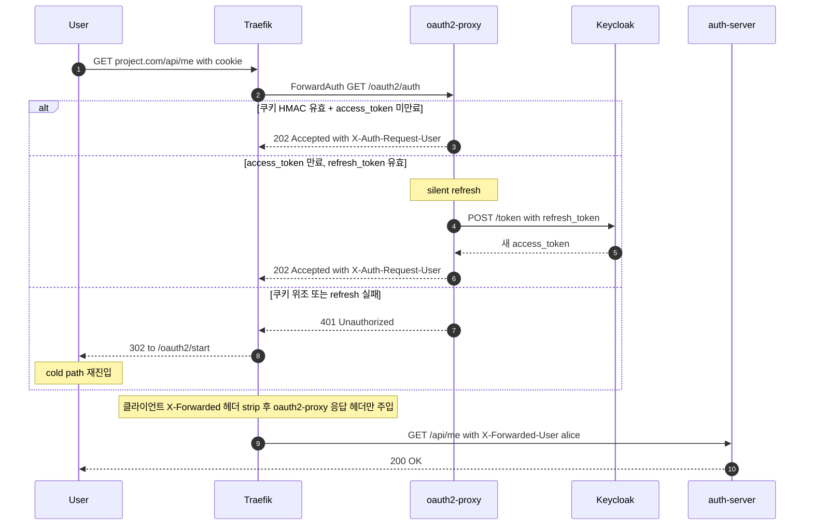

# ForwardAuth · Warm Path (세션 쿠키 보유)

쿠키 검증으로 끝나는 평소 요청 경로. **운영 트래픽의 99% 가 이 흐름** 이다. cold path 의 OIDC handshake 는 세션 만료 시에만 다시 일어난다.

3 가지 결과가 있다: (1) 쿠키 정상 → 즉시 통과, (2) access_token 만료 → silent refresh 후 통과, (3) 쿠키 위조 또는 refresh 실패 → cold path 재진입.

## 핵심 인사이트

- **백엔드가 헤더만 신뢰해도 안전한 이유**: Traefik 의 ForwardAuth Middleware 가 *클라이언트로부터 들어온* `X-Forwarded-*` 헤더를 strip 하고, *oauth2-proxy 응답에 담긴* 헤더만 백엔드로 전달한다. 클라이언트가 위조한 `X-Forwarded-User: admin` 은 도달하지 못한다. **이 strip 동작이 무너지면 권한 우회 취약점**이 되므로 Traefik Middleware 의 `authResponseHeaders` 와 (Traefik global) `forwardedHeaders` 설정이 핵심.
- **백엔드 코드 단순화의 실체**: `auth-server` 의 컨트롤러는 `request.getHeader("X-Forwarded-User")` 한 줄만 본다. JWT 라이브러리, JWKS 캐시, 쿠키 파서, 세션 스토어가 모두 사라진다. 단위 테스트도 헤더 1 개 주입으로 인증된 사용자 시나리오가 만들어진다.
- **silent refresh 는 사용자에게 보이지 않음**: alt 의 두 번째 분기가 그 경우. 사용자 브라우저는 redirect 를 안 본다 — Traefik ForwardAuth 호출 안에서 refresh 가 끝나고 같은 응답이 202 로 돌아온다.
- **위조 시 회귀 경로**: 세 번째 분기. 쿠키 HMAC 가 안 맞거나 refresh 가 실패하면 oauth2-proxy 가 401 을 반환하고, Traefik 이 cold path 의 시작점인 `/oauth2/start` 로 돌려보낸다. 즉 **공격자가 쿠키를 위조해 봤자 결과는 로그인 페이지로의 redirect 일 뿐**이다.

## 처음 로그인 시 흐름은?

→ [forward-auth-cold.md](forward-auth-cold.md)
