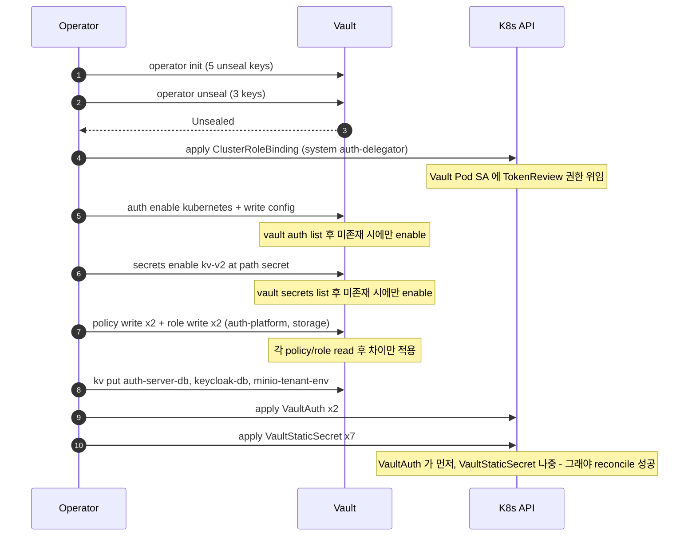

# Secret Pipeline · Bootstrap (1 회)

`tasks/vault-init.sh` 가 클러스터 최초 셋업 시 한 번만 수행하는 흐름. Vault 의 Kubernetes auth method 와 두 개의 role/policy, 그리고 VSO 가 사용할 VaultAuth CR 까지 준비한다. 모든 단계는 멱등 체크 후 차이만 적용된다 — Note 에 명시된 read 호출이 그 체크 지점.

## 핵심 인사이트

- **두 role 의 의도**: VSO 의 ServiceAccount 는 `vault-secrets-operator/mnt` 한 개뿐이다. 그러나 Vault 에 role 두 개를 두고 각각 다른 policy 를 묶었다. **VaultStaticSecret 마다 자기 도메인의 VaultAuth CR 을 참조**하므로, auth-platform role 의 토큰이 유출돼도 minio secret 은 못 읽는다.
- **`system:auth-delegator` 의 위치**: 이 ClusterRoleBinding 은 *Vault Pod 의 SA* 에 부여된다. Vault 가 VSO 의 SA JWT 를 검증하기 위해 K8s 의 `TokenReview` API 를 호출할 권한이 필요하기 때문. VSO 측이 아니라 Vault 측에 붙는다는 점이 자주 헷갈리는 지점.
- **멱등성의 위치**: 각 enable / write 호출 직전에 `vault auth list`, `vault secrets list`, `vault policy read`, `vault read auth/kubernetes/role/<name>` 으로 현재 상태를 체크하고 차이만 적용한다. 따라서 이 다이어그램의 모든 단계는 *재실행 안전*.
- **마지막 두 단계의 순서**: VaultAuth 가 먼저, VaultStaticSecret 이 나중. 그래야 VSO 가 첫 reconcile 에서 `vaultAuthRef` 를 정상 해석한다.

## 정상 운영 시 reconcile 흐름은?

→ [secret-pipeline-runtime.md](secret-pipeline-runtime.md)
