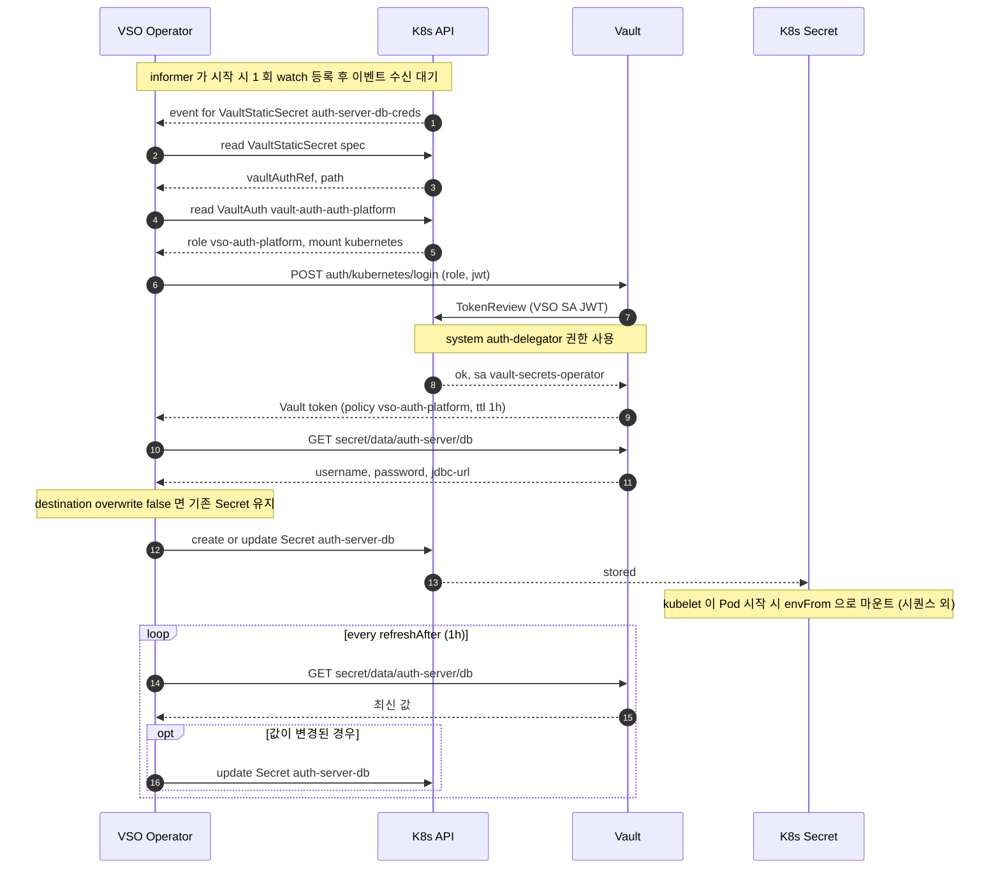

# Secret Pipeline · Steady-State Reconcile

VSO 가 VaultStaticSecret CR 을 reconcile 할 때마다 일어나는 흐름. **이 다이어그램은 한 reconcile 사이클** 만 다룬다 — 부트스트랩(정책/role/CR 적용) 은 [secret-pipeline-bootstrap.md](secret-pipeline-bootstrap.md) 에서 이미 끝난 상태를 전제한다.

VSO 는 controller-runtime 기반이라 informer 가 *시작 시 1 회 watch 등록* 하고, 이후 K8s API 가 push 하는 이벤트로 reconcile 이 트리거된다. 즉 매 cycle 마다 watch 호출이 새로 일어나는 게 아니다.

## 핵심 인사이트

- **이 다이어그램의 시작점은 K8s 가 던지는 event**: VSO 가 매 cycle 마다 watch API 를 새로 호출하는 게 아니다. controller-runtime 의 informer 가 startup 에 watch 를 establish 하고, K8s API 가 변경 사항을 push 하면 reconcile loop 이 깨어난다. 그래서 메시지 1 의 화살표 방향이 K8s → VSO.
- **TokenReview 는 VSO 가 부르는 게 아니라 Vault 가 부른다**: 메시지 7 (`Vault to K8s API: TokenReview`) 가 그 호출. Vault 가 *받은* SA JWT 가 진짜 VSO 의 것인지 확인하기 위해 K8s 에 위임 검증한다.
- **role 결정은 VaultAuth CR 이 한다**: 메시지 4~5 에서 VSO 는 *VaultStaticSecret 이 가리키는 VaultAuth* 를 읽고, 거기에 박힌 `role: vso-auth-platform` 으로 Vault login 한다. 같은 SA 라도 어느 VaultAuth 를 거쳤느냐에 따라 받는 policy 가 달라진다.
- **`overwrite=false` 의 책임 위치**: 이건 K8s API 의 동작이 아니라 *VSO reconciler 가 update 호출 전에 자기 로직으로 결정* 한다. 그래서 Note 가 VSO 위에 붙는다.
- **즉시 반영**: Vault 값 변경 직후 반영하려면 `kubectl -n mnt delete secret auth-server-db`. 다음 reconcile 에서 VSO 가 위 흐름을 다시 돌아 새 값으로 재생성한다 — Pod 는 envFrom 으로 받은 값이 바뀌었음을 자동으로 알 수 없으므로 rollout 도 함께.
